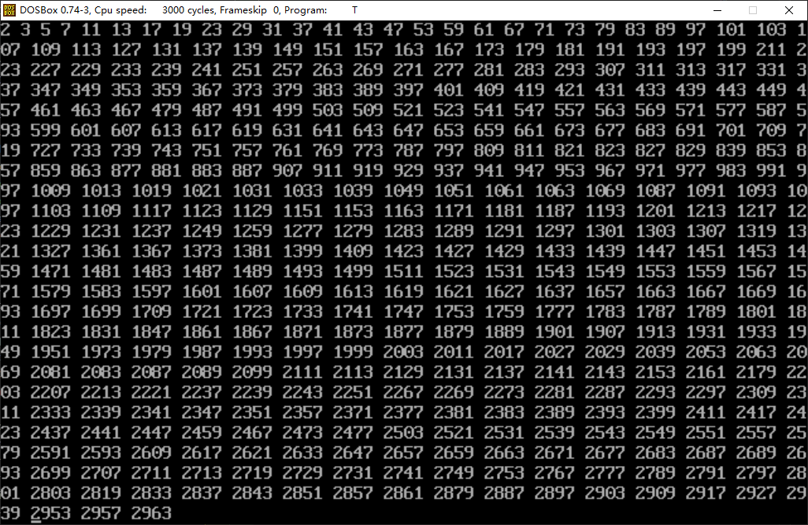
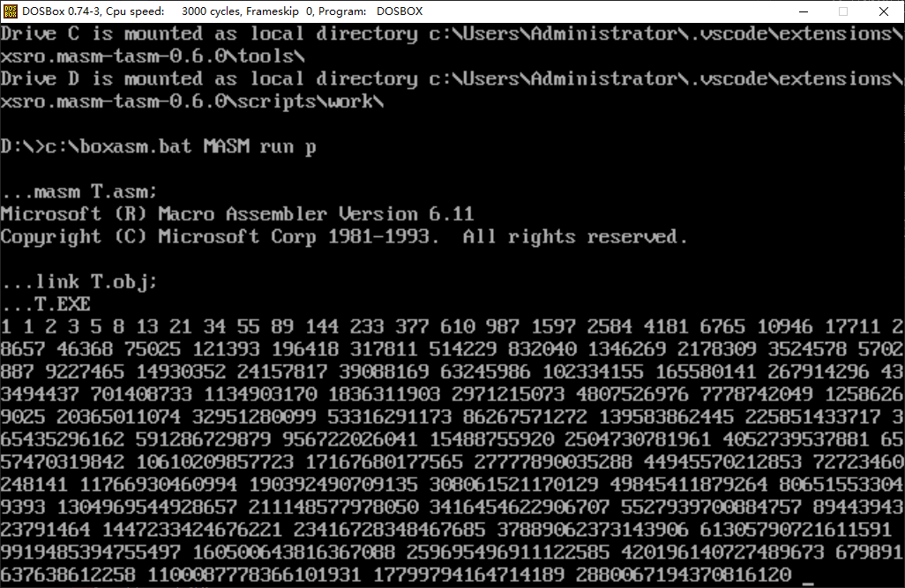
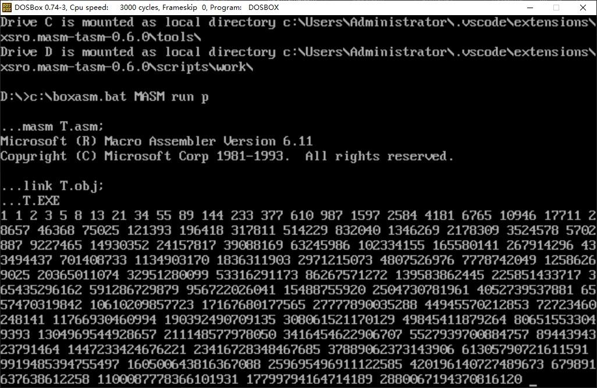

> 爱你的老师甚至允许你在他的课上听别的老师上课

下代码前先跟我大喊：

# 东哥, yyds！

本仓库包含有三个东哥布置的任务，即：

    1. 打印10万以内的素数
    2. 使用递推打印斐波那契数列的前50项
    3. 使用递归打印斐波那契数列的前50项

[orafli.asm](orafli.asm)是筛10万(1e5)以内的素数（n^2暴筛，acm白打了）~~不过默认设置的是1e6~~

[fibomem1.asm](fibomem1.asm)是斐波那契数列的递推版，采用2*32精度，最多只能筛到89位(2880067194370816120)

[fibomem2.asm](fibomem2.asm)是斐波那契数列的递归版，采用2*32精度，最多只能筛到89位(2880067194370816120)

以上代码均已在vscode的汇编一键包即`xsro.masm-tasm`版本0.6.0扩展程序下测试通过

这个屎仓库就别star了，来抱完代码顺路来看看无人问津的[女儿irori](https://github.com/voidf/bot_irori)吧（

# LICENSE

Anti 996 License v1.0